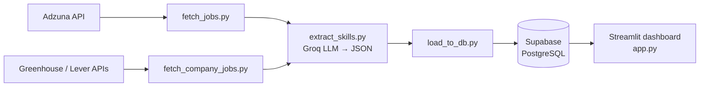

# 📊 AI Job Market Intelligence

An end-to-end data pipeline and dashboard that collects data analyst and data scientist job postings, uses an LLM to extract the skills each job requires, and helps job seekers see which roles fit their resume and which skills to learn next.

## Features

- **Multi-source job collection**: the Adzuna API plus public company career pages (Greenhouse and Lever APIs) for 30 tech companies
- **AI skill extraction**: an LLM (Groq, `gpt-oss`) reads each job description and returns structured JSON: skills, seniority, work mode, and years of experience
- **Cloud database**: jobs are stored in Supabase (PostgreSQL) with de-duplicating upserts
- **Interactive dashboard** (Streamlit + Plotly):
  - Market overview: top skills, hiring companies, seniority, remote vs. onsite, salaries
  - Job explorer: search by title, company, or skill
  - Resume analyzer: upload a PDF resume to get a match score for each job and a list of skill gaps

## Architecture



## Tech stack

| Layer | Tools |
|---|---|
| Data collection | Python, Requests, REST APIs |
| AI / NLP | Groq API (`gpt-oss` models), JSON mode, prompt engineering |
| Data processing | pandas |
| Database | Supabase (PostgreSQL) |
| Dashboard | Streamlit, Plotly |
| Resume parsing | pypdf |

## Project structure

```
job-market-intelligence/
├── pipeline/
│   ├── fetch_jobs.py          # Adzuna API → data/jobs.csv
│   ├── fetch_company_jobs.py  # Greenhouse/Lever → data/company_jobs.csv
│   ├── companies.csv          # list of company job boards
│   ├── extract_skills.py      # LLM extraction → data/jobs_enriched.csv
│   └── load_to_db.py          # upload to Supabase
├── app.py                     # Streamlit dashboard
├── requirements.txt
└── README.md
```

## Run it locally

1. Clone the repo and create a virtual environment:
   ```bash
   git clone https://github.com/sanjanajagarapu1-dotcom/job-market-intelligence.git
   cd job-market-intelligence
   python -m venv venv
   venv\Scripts\activate
   pip install -r requirements.txt
   ```
2. Create a `.env` file with free API keys from [Adzuna](https://developer.adzuna.com), [Groq](https://console.groq.com), and [Supabase](https://supabase.com):
   ```
   ADZUNA_APP_ID=...
   ADZUNA_APP_KEY=...
   GROQ_API_KEY=...
   SUPABASE_URL=...
   SUPABASE_KEY=...
   ```
3. Run the pipeline, then the dashboard:
   ```bash
   python pipeline/fetch_jobs.py
   python pipeline/fetch_company_jobs.py
   python pipeline/extract_skills.py
   python pipeline/load_to_db.py
   streamlit run app.py
   ```

## Screenshots

_Coming soon_

## Data sources and notes

- Jobs by [Adzuna](https://www.adzuna.com). Adzuna descriptions are truncated, so skill extraction relies mainly on the career-page sources.
- Company jobs come from the public Greenhouse and Lever job board APIs.
- Skills are extracted by an LLM and may contain errors.
