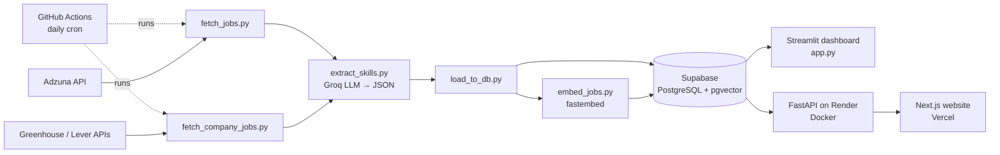
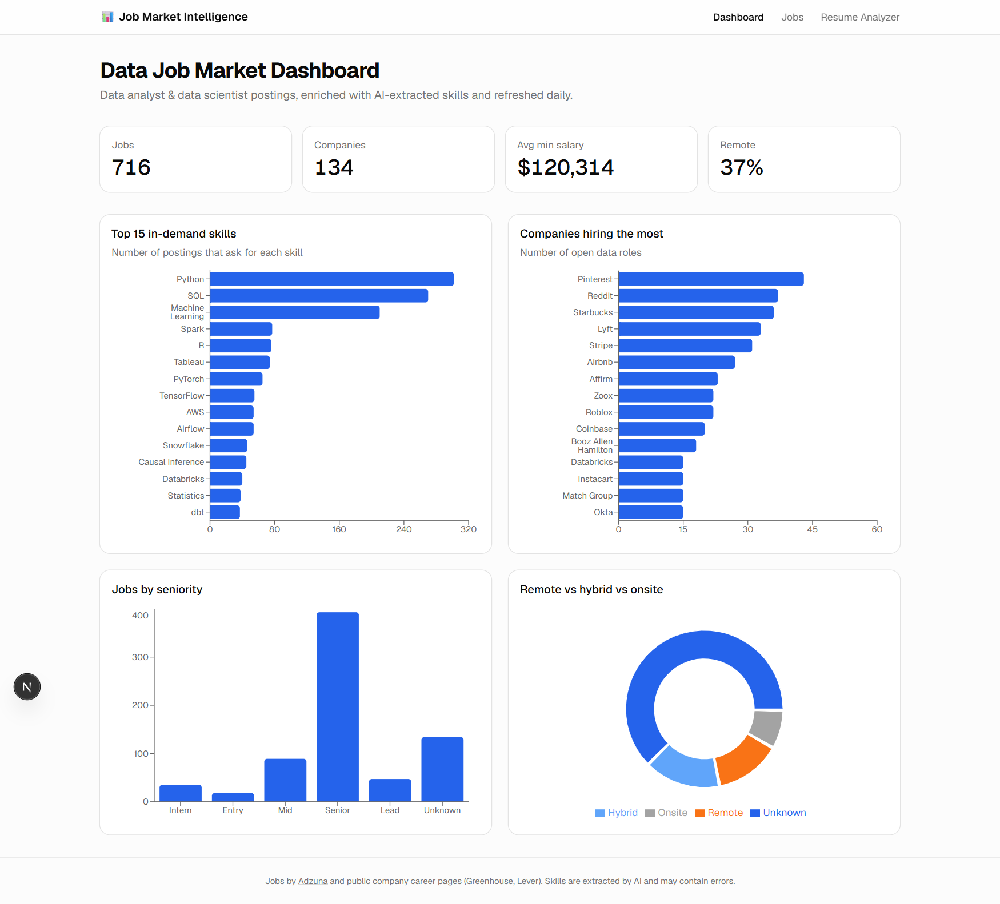
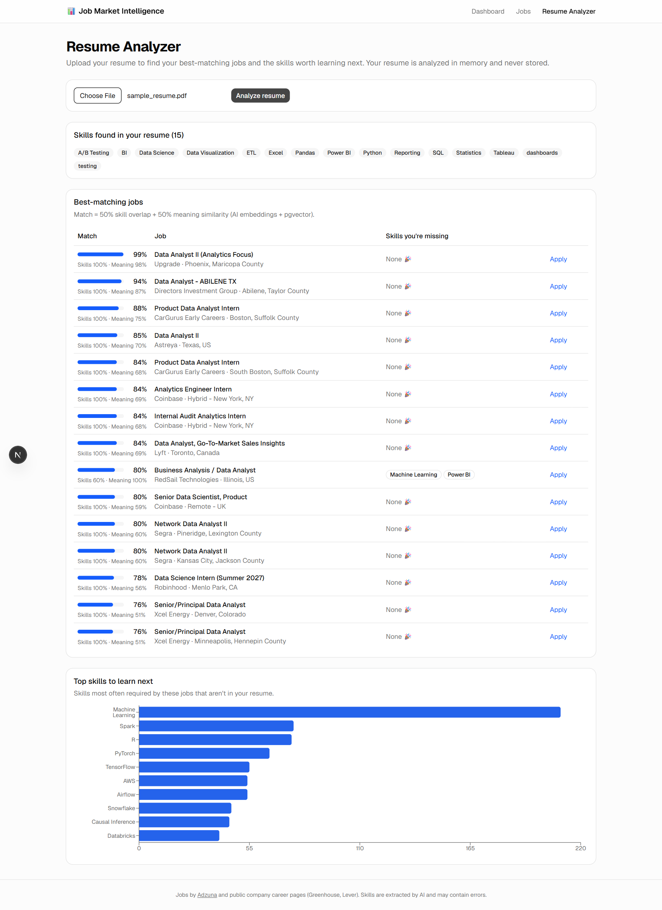
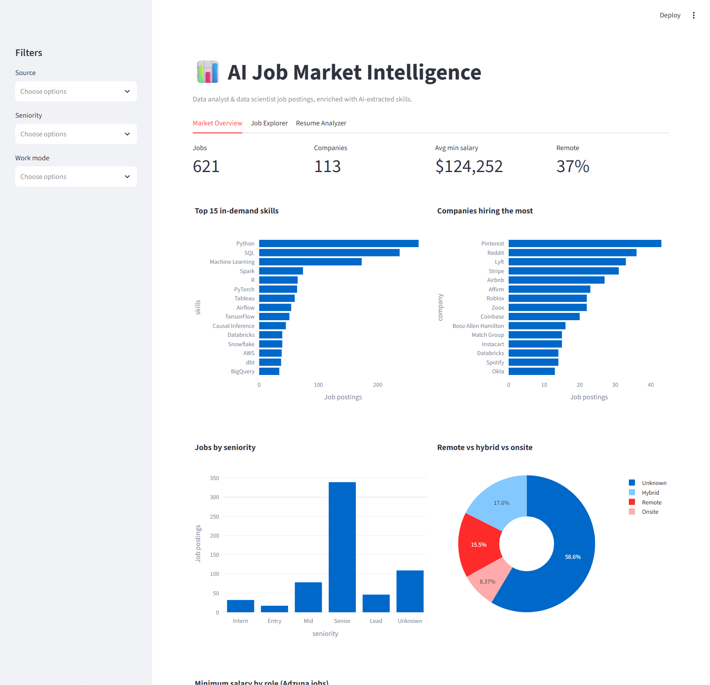
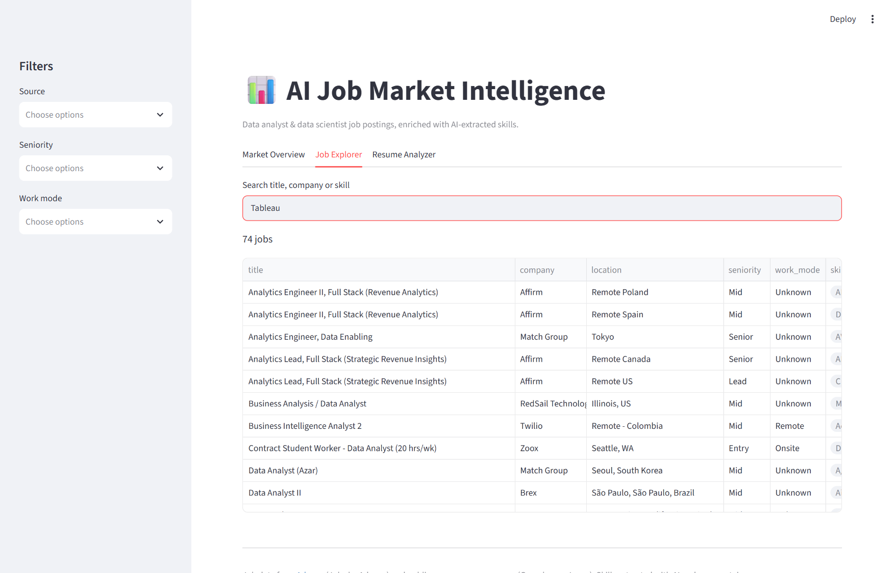
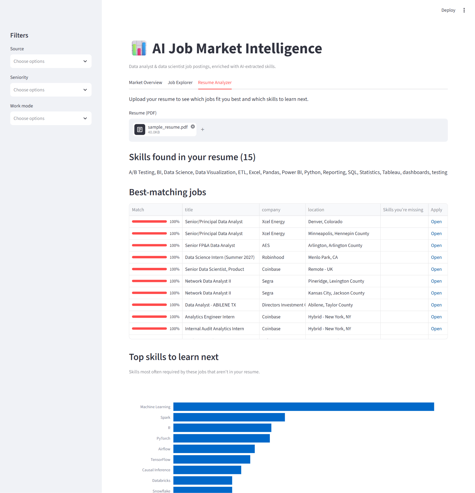

# 📊 AI Job Market Intelligence

[](https://github.com/sanjanajagarapu1-dotcom/job-market-intelligence/actions/workflows/tests.yml)
[](https://github.com/sanjanajagarapu1-dotcom/job-market-intelligence/actions/workflows/daily_refresh.yml)

- 🔗 **Live website (Next.js):** [job-market-intelligence-six.vercel.app](https://job-market-intelligence-six.vercel.app)
- 🔗 **Live API docs (FastAPI):** [job-market-api-fezz.onrender.com/docs](https://job-market-api-fezz.onrender.com/docs)
- 🔗 **Streamlit dashboard:** [job-market-intelligence-gnjvwgxazlj66yfrimq74p.streamlit.app](https://job-market-intelligence-gnjvwgxazlj66yfrimq74p.streamlit.app)

> The API runs on Render's free tier, so the first page load after it has been idle can take 30–60 seconds while the server wakes up.

An end-to-end data pipeline and dashboard that collects data analyst and data scientist job postings, uses an LLM to extract the skills each job requires, and helps job seekers see which roles fit their resume and which skills to learn next.

## Features

- **Multi-source job collection**: the Adzuna API plus public company career pages (Greenhouse and Lever APIs) for 30 tech companies
- **AI skill extraction**: an LLM (Groq, `gpt-oss`) reads each job description and returns structured JSON: skills, seniority, work mode, and years of experience
- **Cloud database**: jobs are stored in Supabase (PostgreSQL) with de-duplicating upserts
- **Automated daily refresh**: a GitHub Actions cron job runs the whole pipeline every day, and the AI processes only new jobs
- **Interactive dashboard** (Streamlit + Plotly):
  - Market overview: top skills, hiring companies, seniority, remote vs. onsite, salaries
  - Job explorer: search by title, company, or skill
  - Resume analyzer: upload a PDF resume to get a match score for each job and a list of skill gaps
- **Semantic matching with embeddings**: each job and resume is turned into a 384-dimension embedding (`bge-small-en`, via fastembed) and stored in **pgvector**. The match score combines skill overlap (50%) with meaning similarity (50%), so "built Tableau dashboards" matches "data visualization" even without shared keywords.

## Architecture



## Tech stack

| Layer | Tools |
|---|---|
| Data collection | Python, Requests, REST APIs |
| AI / NLP | Groq API (`gpt-oss` models), JSON mode, prompt engineering |
| Data processing | pandas |
| Database | Supabase (PostgreSQL), pgvector |
| Embeddings | fastembed (`BAAI/bge-small-en-v1.5`, 384 dims) |
| Dashboard | Streamlit, Plotly |
| API | FastAPI, Uvicorn, Pydantic |
| Website | Next.js 16, React, TypeScript, Tailwind CSS, shadcn/ui, Recharts, Vercel |
| Resume parsing | pypdf |
| Testing / CI | pytest, FastAPI TestClient, GitHub Actions (tests, lint, build, Docker smoke test) |
| Automation / deployment | GitHub Actions daily pipeline, Docker, Render, Vercel, Streamlit Community Cloud |

## Project structure

```
job-market-intelligence/
├── pipeline/
│   ├── fetch_jobs.py          # Adzuna API → data/jobs.csv
│   ├── fetch_company_jobs.py  # Greenhouse/Lever → data/company_jobs.csv
│   ├── companies.csv          # list of company job boards
│   ├── extract_skills.py      # LLM extraction → data/jobs_enriched.csv
│   ├── load_to_db.py          # upload to Supabase
│   └── embed_jobs.py          # job embeddings → pgvector
├── .github/workflows/
│   └── daily_refresh.yml      # daily pipeline run
├── backend/
│   ├── main.py                # FastAPI endpoints
│   ├── data.py                # loading, stats, resume matching
│   └── requirements.txt
├── frontend/                  # Next.js website (dashboard, jobs, resume pages)
├── tests/                     # pytest: pipeline helpers + API endpoints
├── sql/schema.sql             # database tables, pgvector, match_jobs()
├── docs/                      # screenshots
├── app.py                     # Streamlit dashboard
├── requirements.txt
└── README.md
```

## Run it locally

1. Clone the repo and create a virtual environment:
   ```bash
   git clone https://github.com/sanjanajagarapu1-dotcom/job-market-intelligence.git
   cd job-market-intelligence
   python -m venv venv
   venv\Scripts\activate
   pip install -r requirements.txt
   ```
2. Create a `.env` file with free API keys from [Adzuna](https://developer.adzuna.com), [Groq](https://console.groq.com), and [Supabase](https://supabase.com):
   ```
   ADZUNA_APP_ID=...
   ADZUNA_APP_KEY=...
   GROQ_API_KEY=...
   SUPABASE_URL=...
   SUPABASE_KEY=...
   ```
3. Run the pipeline, then the dashboard:
   ```bash
   python pipeline/fetch_jobs.py
   python pipeline/fetch_company_jobs.py
   python pipeline/extract_skills.py
   python pipeline/load_to_db.py
   python pipeline/embed_jobs.py
   streamlit run app.py
   ```

## REST API (FastAPI)

The `backend/` folder serves the same data as a JSON API, with interactive docs at `/docs`.

**🔗 Live API: [job-market-api-fezz.onrender.com/docs](https://job-market-api-fezz.onrender.com/docs)**. It runs in Docker on Render's free tier, so the first request after it has been idle takes about 30–60 seconds to wake up.

| Method | Endpoint | Returns |
|---|---|---|
| GET | `/jobs?search=&source=&seniority=&work_mode=&limit=&offset=` | Filtered, paginated jobs |
| GET | `/stats/summary` | Job count, companies, average salary, remote share |
| GET | `/stats/top-skills` | Most requested skills |
| GET | `/stats/companies` | Companies hiring the most |
| GET | `/stats/seniority`, `/stats/work-mode` | Job counts by level and by work mode |
| POST | `/resume/match` (PDF upload) | Best-matching jobs, skill gaps, skills to learn |

Run it locally:
```bash
uvicorn backend.main:app --reload
# open http://localhost:8000/docs
```

## Screenshots

### Next.js website

**Dashboard**



**Resume analyzer**



### Streamlit dashboard

**Market overview**: KPIs, top skills, top hiring companies, seniority and work mode



**Job explorer**: search across 600+ jobs by title, company or skill



**Resume analyzer**: match score for each job and the top skills to learn next (shown with a sample resume)



## Data sources and notes

- Jobs by [Adzuna](https://www.adzuna.com). Adzuna descriptions are truncated, so skill extraction relies mainly on the career-page sources.
- Company jobs come from the public Greenhouse and Lever job board APIs.
- Skills are extracted by an LLM and may contain errors.
